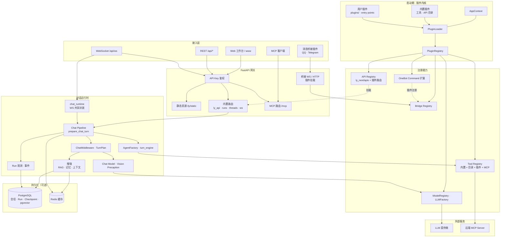
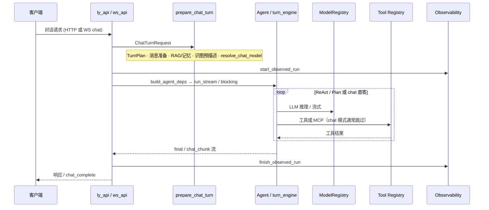

<div align="center">

# LY-NEXT

**基于 FastAPI 与 LangGraph 的智能体服务，内置 Web 工作台，PostgreSQL / Redis 可选**

<br />

[](./LICENSE)
[](https://www.python.org/downloads/)
[](https://fastapi.tiangolo.com/)
[](https://github.com/langchain-ai/langgraph)
[](./docker/README.md)

<br />

[](https://github.com/liuyingjiang-wei/LY-NEXT)
[](https://gitee.com/wei2335/LY-NEXT)
[](https://gitcode.com/liuyingjiang/ly-next)
[](./pyproject.toml)
[](#概览)

</div>

当前版本为 **1.0.1**，项目阶段标注为 **Alpha**（见 `pyproject.toml`）。适合自托管与功能验证；若面向公网部署，请先执行 `uv run ly doctor`，并阅读 [SECURITY.md](./SECURITY.md)，在工作台「安全」页完成相关检查。

---

## 目录

- [概览](#概览)
- [特性](#特性)
- [目录结构](#目录结构)
- [架构](#架构)
- [快速开始](#快速开始)
- [上手路径](#上手路径)
- [Web 工作台](#web-工作台)
- [扩展插件](#扩展插件)
- [消息桥接插件](#消息桥接插件)
- [Docker](#docker)
- [安装依赖](#安装依赖)
- [配置](#配置)
- [常用接口](#常用接口)
- [文档](#文档)
- [开发](#开发)
- [常见问题](#常见问题)

---

## 概览

LY-NEXT 将 HTTP / WebSocket 对话、工具与 MCP、模型注册表、Run 追踪及会话持久化集成在同一服务进程中。启动后可通过 `/ly/` 工作台完成模型配置、智能对话与运维管理，无需单独部署前端应用。

默认配置便于本地开发（例如 CORS 范围较宽）。生产或公网暴露前，请收紧 `auth` 及相关安全项。

---

## 特性

| 能力 | 说明 |
|------|------|
| **Agent** | ReAct、Plan-then-Act、Coordinator、Chat |
| **模型** | OpenAI、Anthropic、Ollama、OpenAI 兼容网关 |
| **工具 / MCP** | 内置工具与 MCP Server；支持挂载远端 MCP |
| **存储** | PostgreSQL + pgvector、Redis（可选，缺失时自动降级） |
| **Web** | 首页 `/`、工作台 `/ly/`（含智能对话 Tab）、登录 `/ly/login` |
| **扩展** | `plugins/` 目录插件、pip entry point、动态 API 与工具目录 |
| **消息桥接** | 可选插件：QQ / NapCat（OneBot v11）、Telegram Bot |
| **能力插件** | 可选：如 jmcomic（搜索/下载/PDF、Agent 工具、QQ `#车牌`） |

---

## 目录结构

| 路径 | 说明 |
|------|------|
| `ly_next/` | Python 应用包（API、Agent、插件内核） |
| `config/` | 默认配置模板，首次运行参与生成用户配置 |
| `plugins/` | 示例单文件插件（`hello_plugin.py`）；**独立插件**安装到 `plugins/local/` 或通过 pip |
| `ly_next/apis/` | 以 `.py` 形式扩展的 HTTP API |
| `install/` | 本机 Redis / PostgreSQL 安装脚本 |
| `data/` | 运行时数据、`config.yaml`、提示词与日志 |
| `www/` | Web 首页、工作台等静态资源（已构建产物，随仓库发布） |

---

## 架构

下图按仓库当前实现整理，覆盖接入、网关、插件内核、对话运行时、外部依赖与可选存储。PostgreSQL / Redis 未部署时，会话持久化、RAG、Run 追踪等能力相应降级。

### 系统分层



### 对话请求路径

HTTP `POST /api/chat` 与 WebSocket `type=chat` 共用同一套预处理与执行链（详见 [TECHNICAL.md](./TECHNICAL.md)）：



**说明：**

| 模块 | 职责 |
|------|------|
| **PluginLoader** | 启动时加载插件并向 Tool / LLM / API / Bridge 注册；`plugins.enabled=false` 时仅保留内置插件 |
| **prepare_chat_turn** | 对话前统一入口：中间件、TurnPlan、并行 prep、模型解析与 Agent 调度 |
| **chat_runtime** | WebSocket 专用：`prepare_turn` · `iter_turn_stream` · 任务生命周期 |
| **消息桥接** | QQ / Telegram 以插件挂载；WS 桥接在 `create_app` 早期注册 |
| **OneBot 指令** | 插件可注册 `#车牌` 等命令，在 auto_reply 之前由 core 分发 |
| **MCP** | 对外暴露 `/mcp`；内置工具同步注册；可选连接远端 MCP Server |

---

## 快速开始

```bash
git clone https://github.com/liuyingjiang-wei/LY-NEXT.git
cd LY-NEXT
uv sync
uv run ly
```

浏览器访问：

| 地址 | 说明 |
|------|------|
| `http://127.0.0.1:8000/` | 首页 |
| `http://127.0.0.1:8000/ly/` | 工作台（需登录） |
| `http://127.0.0.1:8000/docs` | OpenAPI 文档 |

**环境要求：** Python ≥ 3.10（推荐 3.11 或 3.12）、[uv](https://docs.astral.sh/uv/) 包管理器。`uv sync` 默认安装开发依赖（pytest、ruff 等）；构建最小运行镜像时可使用 `uv sync --no-default-groups`。

```bash
uv run ly --reload              # 开发时启用代码热重载
uv run ly                       # 交互式选择监听端口
uv run ly --port 9000
uv run ly --no-prompt           # 使用配置文件或环境变量，不交互询问
LY_NEXT_PORT=9000 uv run ly --no-prompt
uv run ly doctor                # 环境诊断（LLM、PG、Redis、安全项）
```

---

## 上手路径

分步说明见 **[docs/QUICKSTART.md](./docs/QUICKSTART.md)**（共五条路径，每条约四至五步）：

| 路径 | 适用场景 | 要点 |
|------|----------|------|
| **① 只聊天** | 本机验证 Agent | Ollama 或兼容网关；可不安装 PostgreSQL |
| **② 完整栈** | 持久化与 RAG | 通过 Docker 或 install 脚本启动 PG 与 Redis；在工作台试检索 |
| **③ QQ 桥接** | NapCat 自动回复 | 启用 `qq-onebot` 插件；工作台「QQ 桥接」页配置 |
| **④ Telegram 桥接** | Bot 私聊自动回复 | 启用 `telegram-bot`；用户拿配对码，工作台批准 |
| **⑤ JMComic** | 漫画搜索/下载 + QQ `#车牌` | 安装 `jmcomic_plugin` 依赖；需与 ③ 同开 qq-onebot |

---

## Web 工作台

工作台由 FastAPI 直接托管 `www/` 静态资源，无需额外部署前端服务。

| 路径 | 说明 |
|------|------|
| `/` | 产品首页 |
| `/ly/` | 主控制台 |
| `/ly/login` | 登录页；提交 `api_key` 后写入 Cookie |
| `/ly/static/*` | 样式、脚本与图片 |

> `/ly/chat` 会 307 重定向到 `/ly/?tab=chat`，便于旧书签兼容。

**鉴权：** 请求需携带 `X-API-Key` 请求头，或通过 `/ly/login` 登录后使用 Cookie。密钥对应 `auth.api_key`，与 LLM 提供商密钥无关。首次启动会在 `data/ly_next/FIRST_RUN.txt` 中记录；控制台日志默认对密钥脱敏显示。

**主要能力：**

- 顶部横幅调用 `GET /api/system/readiness`，在缺少 LLM、PostgreSQL 或 Redis 时给出提示。
- **智能对话**（工作台 Tab 或 `/ly/?tab=chat`）：场景预设决定推理模式（通用/写作 → `chat` 单轮直答；联网/办公 → `react` 工具链）。WebSocket 事件：`chat_ack` → `chat_started` → `chat_status` → `chat_think_chunk`（推理模型思考过程，可折叠）→ `chat_chunk` → `chat_complete`。
- 「智能对话」在开启同步且已连接 PostgreSQL 时，会创建并持久化 `thread_id`，支持导出 / 导入 JSON 备份。
- 配置读写通过 `GET/PATCH /api/system/settings`；保存响应包含 `settings_effects`（热更新、需重启项及注意事项）。
- 「模型配置」通过 `GET/POST /api/models` 管理注册表、切换默认模型与连通性测试；「RAG 配置」支持试检索。
- 开启 `agent.observability.store_prompts` 后，「Run 历史」可查看完整 LLM 请求内容。
- **设置 → 基础设施** 展示**已加载插件**（内置与用户插件、桥接状态），数据来自 `GET /api/system/extensions`。

---

## 扩展插件

服务启动时，`PluginLoader` 按以下顺序加载：内置插件 → `plugins/` 与 `plugins.extra_dirs`（默认含 `plugins/local/`）→ `plugins.modules` → pip 的 `ly_next.plugins` entry point。

**插件与 core 分仓开发**：第三方或自研插件不要提交进本仓库，详见 **[plugins/README.md](./plugins/README.md)**。

在 `plugins/` 中新增单文件并导出 `plugin` 实例即可接入，可参考 `plugins/hello_plugin.py`：

```python
from ly_next.core.plugin.protocol import LyNextPlugin

class MyPlugin(LyNextPlugin):
    name = "my-stuff"
    version = "0.1.0"

    def register_tools(self, registry, ctx):
        ...

plugin = MyPlugin()
```

其它扩展方式：

| 方式 | 配置 / 位置 | 说明 |
|------|-------------|------|
| 动态 HTTP API | `ly_next/apis/*.py` | 详见 [ly_next/apis/README.md](./ly_next/apis/README.md) |
| 动态工具 | `tools.plugin_dir` | 放置带 `@tool` 装饰器的 `.py` 文件 |
| pip 插件 | `pyproject.toml` → `[project.entry-points."ly_next.plugins"]` | 适用于打包分发 |

生产环境下，`plugins.security_profile` 与 `api.security_profile` 会拒绝未列入信任列表的文件，细则见 [SECURITY.md](./SECURITY.md)。当前加载情况可在工作台基础设施页查看，或通过 `GET /api/system/extensions` 获取。

实现约定与代码路径索引见 [AGENTS.md](./AGENTS.md)「修改前的定位建议」。

---

## 消息桥接与能力插件（独立仓库 / 本地）

QQ / Telegram 等 **桥接** 与 jmcomic 等 **能力** 插件均在 `plugins/local/` 或通过 pip 安装，**不随 core 提交**。

### 消息桥接

| 插件 | 安装示例 | 说明 |
|------|----------|------|
| **qq-onebot** | `git clone … plugins/local/qq_onebot` | NapCat / OneBot v11；`/api/onebot11/*` |
| **telegram-bot** | `git clone … plugins/local/telegram_bot` | Long polling + 配对码；`/api/telegram/pairing/*` |

配置键：`bridge.onebot11.*`、`bridge.telegram.*`。

### 能力插件（示例）

| 插件 | 说明 | 文档 |
|------|------|------|
| **jmcomic** | 禁漫搜索/下载/PDF；`/api/jmcomic/*`；Agent 工具；QQ `#车牌123456` | [plugins/local/jmcomic_plugin/README.md](./plugins/local/jmcomic_plugin/README.md) |

安装与开发流程见 **[plugins/README.md](./plugins/README.md)**；各插件目录内自带 README。

---

## Docker

详见 [docker/README.md](./docker/README.md)。

```bash
# 仅 Redis + PostgreSQL
docker compose -f docker/docker-compose.yml up -d

# 一键 Demo（依赖 + 应用）
bash docker/demo-up.sh
# Windows: powershell -ExecutionPolicy Bypass -File docker/demo-up.ps1

# 构建并运行应用容器
docker compose -f docker/docker-compose.yml --profile app up -d --build
```

容器内诊断：`docker exec ly-next-app ly doctor`

---

## 安装依赖

可选组件 Redis、PostgreSQL、pgvector 的安装脚本：

```bash
# Linux / macOS
bash install.sh

# Windows
powershell -ExecutionPolicy Bypass -File ".\install.ps1"
```

详细说明见 [install/README.md](./install/README.md)。

---

## 配置

首次启动会在 **`data/ly_next/config.yaml`** 生成用户配置（由模板合并而来，不覆盖已有文件），并初始化 `prompts/`、`knowledge/` 目录。

| 环境变量 | 用途 |
|----------|------|
| `LY_NEXT_CONFIG_DIR` | 用户配置目录（可写） |
| `LY_NEXT_PROJECT_ROOT` | 项目根路径 |
| `LY_NEXT_PORT` | 监听端口（配合 `--no-prompt`） |
| `DATABASE_HOST` / `REDIS_HOST` | 容器或远程服务主机名 |

常用配置项：`llm.models`、`llm.default_model`、`database.*`、`redis.*`、`auth.*`、`plugins.*`

**密钥与 Git：** 用户配置生成在 `data/ly_next/config.yaml`，整个 `data/` 目录已在 `.gitignore` 中，不会随 `git push` 上传。QQ / Telegram 的 token 更推荐用环境变量（见仓库根 `.env.example`：`TELEGRAM_BOT_TOKEN`、`ONEBOT11_ACCESS_TOKEN`），在工作台保存的密钥会以 `***` 脱敏显示。

<details>
<summary><strong>识图预描述</strong></summary>

当多模态模型仅用于图像理解、主对话希望使用更强的纯文本模型时：

1. 启用 `agent.vision_precaption.enabled`
2. 在「模型配置」注册 OpenAI 或 OpenAI 兼容多模态模型，将 `agent.vision_precaption.model_name` 设为该注册名（留空则跳过预描述）
3. 仅对**最后一条**含图消息执行预描述，主模型不再接收图片块

预描述在默认模型解析之前执行；主轮次不含图片时不会触发。

</details>

<details>
<summary><strong>联网搜索与网页抓取（web_search / web_fetch）</strong></summary>

在 `data/ly_next/config.yaml` 中配置：

```yaml
tools:
  web_search:
    provider: duckduckgo   # 或 brave / tavily / searxng 等，见 default_config.yaml
    max_results: 8
  web_fetch:
    provider: jina         # jina | tavily | firecrawl | trafilatura(local)
    api_key: ""            # tavily / firecrawl / jina 按需填写
    default_max_length: 8000
```

Agent 推荐流程：**web_search** 发现链接 → **web_fetch** 读取正文 → 汇总回答并注明来源。对话页「联网调研」场景已内置上述系统提示。

</details>

<details>
<summary><strong>办公文档导出（generate_docx / generate_xlsx / generate_pptx）</strong></summary>

内置工具生成文件至 `data/ly_next/exports/`，返回 `download_url` 供用户下载。对话页「文档办公」场景默认启用 ReAct 模式并挂载上述工具。表格需传 `headers` + `rows`；Word 用 `sections`；PPT 用 `slides`。

</details>

---

## 常用接口

| 方法 | 路径 | 说明 |
|------|------|------|
| GET | `/api/health` | 健康检查 |
| GET | `/api/system/extensions` | 插件、桥接、pgvector、工具数量 |
| GET | `/api/system/readiness` | 工作台就绪检测 |
| GET | `/api/runs`、`/api/runs/{id}/events` | Run 追踪 |
| POST | `/api/threads` | 会话管理（需 PostgreSQL） |
| GET/POST/DELETE | `/api/models` | 模型注册表、默认模型、连通性测试 |
| POST | `/api/chat` | 对话（可选 `thread_id`） |
| GET | `/api/tools` | 工具列表 |
| GET/POST | `/mcp` | MCP 协议 |
| GET | `/api/jmcomic/search` 等 | jmcomic 插件（需安装） |

完整接口列表见 `/docs` 或工作台 **API 调试** 页。

---

## 文档

| 文档 | 内容 |
|------|------|
| [docs/QUICKSTART.md](./docs/QUICKSTART.md) | 五条上手路径 |
| [TECHNICAL.md](./TECHNICAL.md) | 代码阅读路径、Pipeline 与 WS 链路 |
| [plugins/README.md](./plugins/README.md) | 插件安装（桥接 + 能力） |
| [plugins/local/jmcomic_plugin/README.md](./plugins/local/jmcomic_plugin/README.md) | JMComic 插件 |
| [SECURITY.md](./SECURITY.md) | 威胁模型与安全检查项 |
| [AGENTS.md](./AGENTS.md) | 开发约定与模块索引 |
| [ly_next/apis/README.md](./ly_next/apis/README.md) | 自定义 HTTP API 插件 |
| [install/README.md](./install/README.md) | 依赖安装 |
| [docker/README.md](./docker/README.md) | 容器部署 |

---

## 开发

```bash
uv sync
uv run ruff format .
uv run ruff check .
uv run pytest -q
```

**后端开发** 可使用 `uv run ly --reload` 启用热重载。Web 界面以仓库内的 `www/` 为准，直接修改其中的 HTML、CSS、JS 后重启服务即可。

其它常用命令：

```bash
uv run ly --show-full-api-key   # 启动快照中显示完整 API 密钥（默认脱敏）
uv run ly doctor --json         # 以 JSON 格式输出诊断报告
```

---

## 常见问题

<details>
<summary><strong>未生成用户配置文件</strong></summary>

请检查 `data/` 目录或 `LY_NEXT_CONFIG_DIR` 所指路径是否具备写权限。

</details>

<details>
<summary><strong>消息桥接插件未加载或连接失败</strong></summary>

确认 `plugins.enabled: true` 且对应 `bridge.*.enabled: true`。插件需先按 [plugins/README.md](./plugins/README.md) 安装到 `plugins/local/` 或 pip。可在工作台「基础设施」或 `GET /api/system/extensions` 查看已加载插件。

</details>

<details>
<summary><strong>工作台界面更新未生效</strong></summary>

确认已保存对 `www/` 的修改，并重启 `uv run ly`。必要时清除浏览器缓存后重新加载页面。

</details>

<details>
<summary><strong>插件未出现在列表中</strong></summary>

检查 `plugins.enabled` 是否为 `true`。当 `plugins.security_profile` 为 `production` 时，未列入信任列表的文件将被跳过。可在工作台基础设施页刷新列表，或直接请求 `GET /api/system/extensions`。

</details>

<details>
<summary><strong>对话页一直「思考中」但没有回复</strong></summary>

1. 确认 `GET /api/system/readiness` 中 LLM 已配置且可用。
2. 浏览器开发者工具 → Network → WS：应依次收到 `chat_ack`、`chat_started`、`chat_status`（正在调用模型…）、`chat_chunk` 或 `chat_think_chunk`。
3. 使用 DeepSeek **Reasoner** 时，会先长时间输出 `chat_think_chunk`，界面显示「思考过程」折叠块，随后才是正文。
4. 场景「通用助手」发送 `mode: chat`（单轮直答）；若误用全局 ReAct 且未命中工具，可在场景菜单切回通用或检查 `agent.chat_pipeline.auto_direct_chat_mode`。
5. 查看服务端日志 `[ws.chat]` 与 `[turn_engine]` 是否有 LLM 连接/鉴权错误。

</details>

---

<div align="center">

**MIT License** · [LICENSE](./LICENSE)

</div>
