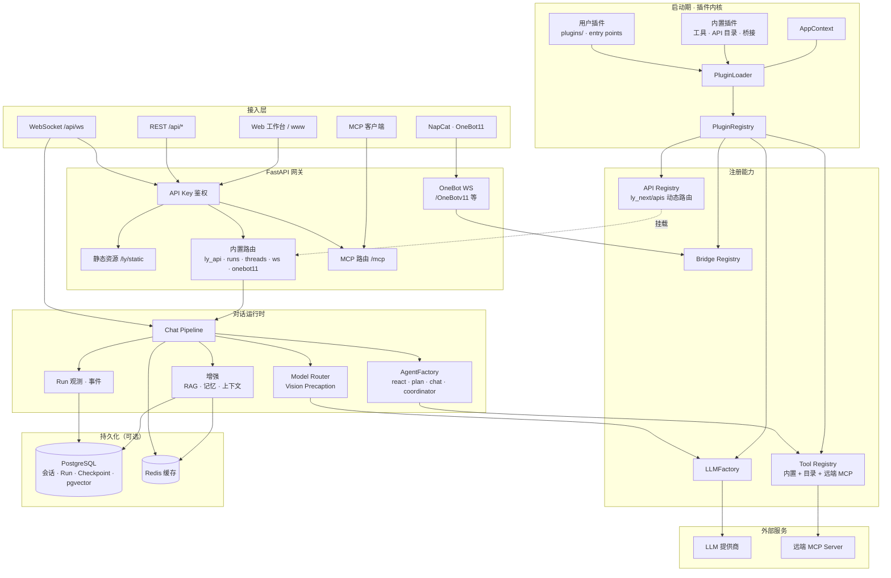
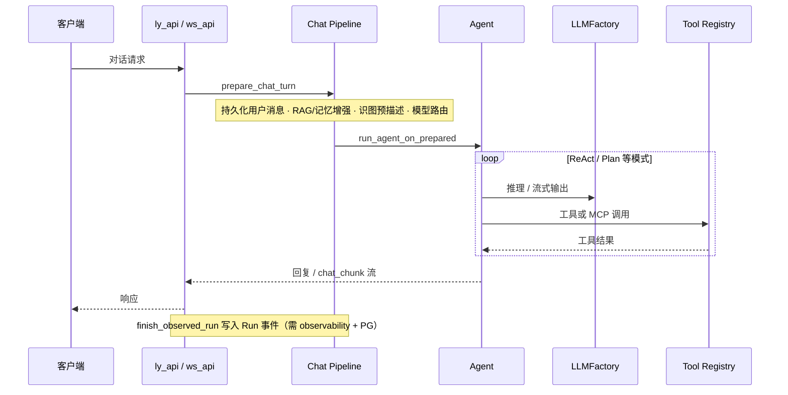

<div align="center">

# LY-NEXT

**基于 FastAPI 与 LangGraph 的智能体服务，内置 Web 工作台，PostgreSQL / Redis 可选**

<br />

[](./LICENSE)
[](https://www.python.org/downloads/)
[](https://fastapi.tiangolo.com/)
[](https://github.com/langchain-ai/langgraph)
[](./docker/README.md)

<br />

[](https://github.com/liuyingjiang-wei/LY-NEXT)
[](https://gitee.com/wei2335/LY-NEXT)
[](https://gitcode.com/liuyingjiang/ly-next)
[](./pyproject.toml)
[](#概览)

</div>

当前版本为 **1.0.1**，项目阶段标注为 **Alpha**（见 `pyproject.toml`）。适合自托管与功能验证；若面向公网部署，请先执行 `uv run ly doctor`，并阅读 [SECURITY.md](./SECURITY.md)，在工作台「安全」页完成相关检查。

---

## 目录

- [概览](#概览)
- [特性](#特性)
- [目录结构](#目录结构)
- [架构](#架构)
- [快速开始](#快速开始)
- [上手路径](#上手路径)
- [Web 工作台](#web-工作台)
- [扩展插件](#扩展插件)
- [NapCat / OneBot](#napcat--onebot-v11)
- [Docker](#docker)
- [安装依赖](#安装依赖)
- [配置](#配置)
- [常用接口](#常用接口)
- [文档](#文档)
- [开发](#开发)
- [常见问题](#常见问题)

---

## 概览

LY-NEXT 将 HTTP / WebSocket 对话、工具与 MCP、多模型路由、Run 追踪及会话持久化集成在同一服务进程中。启动后可通过 `/ly/` 工作台完成模型配置、对话调试与运维管理，无需单独部署前端应用。

默认配置便于本地开发（例如 CORS 范围较宽）。生产或公网暴露前，请收紧 `auth` 及相关安全项。

---

## 特性

| 能力 | 说明 |
|------|------|
| **Agent** | ReAct、Plan-then-Act、Coordinator、Chat |
| **模型** | OpenAI、Anthropic、Ollama、OpenAI 兼容网关 |
| **工具 / MCP** | 内置工具与 MCP Server；支持挂载远端 MCP |
| **存储** | PostgreSQL + pgvector、Redis（可选，缺失时自动降级） |
| **Web** | 首页 `/`、工作台 `/ly/`、登录 `/ly/login` |
| **桥接** | NapCat 反向 OneBot v11 WebSocket |
| **扩展** | `plugins/` 目录插件、pip entry point、动态 API 与工具目录 |

---

## 目录结构

| 路径 | 说明 |
|------|------|
| `ly_next/` | Python 应用包（API、Agent、插件内核） |
| `config/` | 默认配置模板，首次运行参与生成用户配置 |
| `plugins/` | 用户 `LyNextPlugin` 放置目录（示例：`hello_plugin.py`） |
| `ly_next/apis/` | 以 `.py` 形式扩展的 HTTP API |
| `install/` | 本机 Redis / PostgreSQL 安装脚本 |
| `data/` | 运行时数据、`config.yaml`、提示词与日志 |
| `.workbench-src/` | 工作台前端源码（React + Vite） |
| `www/` | 构建后的静态资源，由服务直接提供 |

---

## 架构

下图按仓库当前实现整理，覆盖接入、网关、插件内核、对话运行时、外部依赖与可选存储。PostgreSQL / Redis 未部署时，会话持久化、RAG、Run 追踪等能力相应降级。

### 系统分层



### 对话请求路径

HTTP `POST /api/chat` 与 WebSocket `type=chat` 共用同一套预处理与执行链（详见 [TECHNICAL.md](./TECHNICAL.md)）：



**说明：**

| 模块 | 职责 |
|------|------|
| **PluginLoader** | 启动时加载插件并向 Tool / Agent / LLM / API / Bridge 注册；`plugins.enabled=false` 时仅保留内置插件 |
| **Chat Pipeline** | 对话前的统一入口：消息准备、增强、路由与 Agent 调度 |
| **OneBot** | WS 路由在 `create_app` 阶段挂载，鉴权走 `access_token`，不经过工作台 API Key |
| **MCP** | 对外暴露 `/mcp`；内置工具同步注册；可选连接远端 MCP Server |

---

## 快速开始

```bash
git clone https://github.com/liuyingjiang-wei/LY-NEXT.git
cd LY-NEXT
uv sync
uv run ly
```

浏览器访问：

| 地址 | 说明 |
|------|------|
| `http://127.0.0.1:8000/` | 首页 |
| `http://127.0.0.1:8000/ly/` | 工作台（需登录） |
| `http://127.0.0.1:8000/docs` | OpenAPI 文档 |

**环境要求：** Python ≥ 3.10（推荐 3.11 或 3.12）、[uv](https://docs.astral.sh/uv/) 包管理器。`uv sync` 默认安装开发依赖（pytest、ruff 等）；构建最小运行镜像时可使用 `uv sync --no-default-groups`。

```bash
uv run ly --reload              # 开发时启用代码热重载
uv run ly                       # 交互式选择监听端口
uv run ly --port 9000
uv run ly --no-prompt           # 使用配置文件或环境变量，不交互询问
LY_NEXT_PORT=9000 uv run ly --no-prompt
uv run ly doctor                # 环境诊断（LLM、PG、Redis、安全项）
```

---

## 上手路径

分步说明见 **[docs/QUICKSTART.md](./docs/QUICKSTART.md)**（每条路径约四至五步）：

| 路径 | 适用场景 | 要点 |
|------|----------|------|
| **① 只聊天** | 本机验证 Agent | Ollama 或兼容网关；可不安装 PostgreSQL |
| **② 完整栈** | 持久化与 RAG | 通过 Docker 或 install 脚本启动 PG 与 Redis；在工作台试检索 |
| **③ QQ 桥接** | NapCat 自动回复 | 配置 LLM；NapCat 连接 WebSocket；在诊断页确认状态 |

---

## Web 工作台

工作台由 FastAPI 直接托管 `www/` 静态资源，无需额外部署前端服务。

| 路径 | 说明 |
|------|------|
| `/` | 产品首页 |
| `/ly/` | 主控制台 |
| `/ly/login` | 登录页；提交 `api_key` 后写入 Cookie |
| `/ly/static/*` | 样式、脚本与图片 |

**鉴权：** 请求需携带 `X-API-Key` 请求头，或通过 `/ly/login` 登录后使用 Cookie。密钥对应 `auth.api_key`，与 LLM 提供商密钥无关。首次启动会在 `data/ly_next/FIRST_RUN.txt` 中记录；控制台日志默认对密钥脱敏显示。

**主要能力：**

- 顶部横幅调用 `GET /api/system/readiness`，在缺少 LLM、PostgreSQL 或 Redis 时给出提示。
- 「智能对话」在开启同步且已连接 PostgreSQL 时，会创建并持久化 `thread_id`，支持导出 / 导入 JSON 备份。
- 配置读写通过 `GET/PATCH /api/system/settings`；保存响应包含 `settings_effects`（热更新、需重启项及注意事项）。
- 「应用配置」提供场景预设；「模型配置」支持路由试算；「RAG 配置」支持试检索；「QQ / NapCat」提供连接诊断。
- 开启 `agent.observability.store_prompts` 后，「Run 历史」可查看完整 LLM 请求内容。
- **设置 → 基础设施** 展示**已加载插件**（内置与用户插件、桥接状态），数据来自 `GET /api/system/extensions`。

---

## 扩展插件

服务启动时，`PluginLoader` 按以下顺序加载：内置插件 → `plugins/` 目录 → `plugins.modules` 配置项 → pip 的 `ly_next.plugins` entry point；随后统一注册工具、Agent、API 与桥接。

在 `plugins/` 中新增文件并导出 `plugin` 实例即可接入，可参考 `plugins/hello_plugin.py`：

```python
from ly_next.core.plugin.protocol import LyNextPlugin

class MyPlugin(LyNextPlugin):
    name = "my-stuff"
    version = "0.1.0"

    def register_tools(self, registry, ctx):
        ...

plugin = MyPlugin()
```

其它扩展方式：

| 方式 | 配置 / 位置 | 说明 |
|------|-------------|------|
| 动态 HTTP API | `ly_next/apis/*.py` | 详见 [ly_next/apis/README.md](./ly_next/apis/README.md) |
| 动态工具 | `tools.plugin_dir` | 放置带 `@tool` 装饰器的 `.py` 文件 |
| pip 插件 | `pyproject.toml` → `[project.entry-points."ly_next.plugins"]` | 适用于打包分发 |

生产环境下，`plugins.security_profile` 与 `api.security_profile` 会拒绝未列入信任列表的文件，细则见 [SECURITY.md](./SECURITY.md)。当前加载情况可在工作台基础设施页查看，或通过 `GET /api/system/extensions` 获取。

实现约定与代码路径索引见 [AGENTS.md](./AGENTS.md)「修改前的定位建议」。

---

## NapCat / OneBot v11

<details>
<summary><strong>连接配置与排错</strong></summary>

NapCat 采用 **反向 WebSocket（客户端）** 模式。在 NapCat WebUI → **网络配置** → 新建 **WebSocket 客户端**：

| 项 | 值 |
|----|-----|
| URL | `ws://127.0.0.1:8000/OneBotv11`（端口与 `server.port` 一致） |
| Token | 与 `bridge.onebot11.access_token` 一致；若双方均未配置，则保持为空 |

兼容路径：`ws://127.0.0.1:8000/onebot/v11/ws`。

上述路径**不经过**工作台 `X-API-Key` 鉴权；仅在配置了 `access_token` 时校验 Bearer 或 `?access_token=`。

**出现 403 时的排查步骤：**

1. 完全退出旧进程后重新启动（代码变更后须重启服务）
2. 启动日志中应出现 `[onebot11] NapCat connected`
3. 确认 NapCat 为 **WebSocket 客户端** 模式，URL 路径书写正确

`bridge.onebot11.enabled` 须为 `true`（可在 `data/ly_next/config.yaml` 或工作台 **QQ / NapCat** 页配置）。默认自动回复范围限于私聊与群聊中 @ 本号的消息。

</details>

---

## Docker

详见 [docker/README.md](./docker/README.md)。

```bash
# 仅 Redis + PostgreSQL
docker compose -f docker/docker-compose.yml up -d

# 一键 Demo（依赖 + 应用）
bash docker/demo-up.sh
# Windows: powershell -ExecutionPolicy Bypass -File docker/demo-up.ps1

# 构建并运行应用容器
docker compose -f docker/docker-compose.yml --profile app up -d --build
```

容器内诊断：`docker exec ly-next-app ly doctor`

---

## 安装依赖

可选组件 Redis、PostgreSQL、pgvector 的安装脚本：

```bash
# Linux / macOS
bash install.sh

# Windows
powershell -ExecutionPolicy Bypass -File ".\install.ps1"
```

详细说明见 [install/README.md](./install/README.md)。

---

## 配置

首次启动会在 **`data/ly_next/config.yaml`** 生成用户配置（由模板合并而来，不覆盖已有文件），并初始化 `prompts/`、`knowledge/` 目录。

| 环境变量 | 用途 |
|----------|------|
| `LY_NEXT_CONFIG_DIR` | 用户配置目录（可写） |
| `LY_NEXT_PROJECT_ROOT` | 项目根路径 |
| `LY_NEXT_PORT` | 监听端口（配合 `--no-prompt`） |
| `DATABASE_HOST` / `REDIS_HOST` | 容器或远程服务主机名 |

常用配置项：`openai_llm.api_key`、`llm.default_provider`、`database.*`、`redis.*`、`auth.*`、`plugins.*`

<details>
<summary><strong>识图预描述与多模型路由</strong></summary>

当多模态模型仅用于图像理解、主对话希望使用更强的纯文本模型时：

1. 启用 `agent.vision_precaption.enabled`
2. 配置 `provider` / `model`，或留空以使用 `model_router.routes.vision`
3. 仅对**最后一条**含图消息执行预描述，主模型不再接收图片块

预描述在路由决策之前执行；主轮次不含图片时不会命中 `routes.vision`。若需与路由共用视觉模型，设置 `agent.vision_precaption.use_router_vision_model: true` 并将 `vision_precaption.model` 留空。

</details>

---

## 常用接口

| 方法 | 路径 | 说明 |
|------|------|------|
| GET | `/api/health` | 健康检查 |
| GET | `/api/system/extensions` | 插件、桥接、pgvector、工具数量 |
| GET | `/api/system/readiness` | 工作台就绪检测 |
| GET | `/api/runs`、`/api/runs/{id}/events` | Run 追踪 |
| POST | `/api/threads` | 会话管理（需 PostgreSQL） |
| POST | `/api/chat` | 对话（可选 `thread_id`） |
| GET | `/api/tools` | 工具列表 |
| GET/POST | `/mcp` | MCP 协议 |

完整接口列表见 `/docs` 或工作台 **API 调试** 页。

---

## 文档

| 文档 | 内容 |
|------|------|
| [docs/QUICKSTART.md](./docs/QUICKSTART.md) | 三条上手路径 |
| [TECHNICAL.md](./TECHNICAL.md) | 代码阅读路径与请求链路 |
| [SECURITY.md](./SECURITY.md) | 威胁模型与安全检查项 |
| [AGENTS.md](./AGENTS.md) | 开发约定与模块索引 |
| [ly_next/apis/README.md](./ly_next/apis/README.md) | 自定义 HTTP API 插件 |
| [install/README.md](./install/README.md) | 依赖安装 |
| [docker/README.md](./docker/README.md) | 容器部署 |

---

## 开发

```bash
uv sync
uv run ruff format .
uv run ruff check .
uv run pytest -q
```

**后端开发** 可使用 `uv run ly --reload` 启用热重载。

**工作台前端** 源码位于 `.workbench-src/`（React + Vite），构建产物输出至 `www/`。需要安装 [Node.js](https://nodejs.org/)：

```bash
npm install              # 亦可使用 pnpm install
npm run dev:workbench    # 本地预览（含首页与 firefly 资源处理）
npm run build:workbench  # 构建至 www/；重启 ly 后生效
```

若仅运行服务，可直接修改 `www/` 中的静态文件；涉及组件或样式变更时，建议通过上述构建流程从源码重新生成。

其它常用命令：

```bash
uv run ly --show-full-api-key   # 启动快照中显示完整 API 密钥（默认脱敏）
uv run ly doctor --json         # 以 JSON 格式输出诊断报告
```

---

## 常见问题

<details>
<summary><strong>未生成用户配置文件</strong></summary>

请检查 `data/` 目录或 `LY_NEXT_CONFIG_DIR` 所指路径是否具备写权限。

</details>

<details>
<summary><strong>NapCat 连接失败或返回 403</strong></summary>

参见 [NapCat / OneBot v11](#napcat--onebot-v11) 一节。常见原因包括：服务未重启、连接模式配置错误、access token 不一致。

</details>

<details>
<summary><strong>工作台界面更新未生效</strong></summary>

确认已执行 `npm run build:workbench`，并重启 `uv run ly`。必要时清除浏览器缓存后重新加载页面。

</details>

<details>
<summary><strong>插件未出现在列表中</strong></summary>

检查 `plugins.enabled` 是否为 `true`。当 `plugins.security_profile` 为 `production` 时，未列入信任列表的文件将被跳过。可在工作台基础设施页刷新列表，或直接请求 `GET /api/system/extensions`。

</details>

---

<div align="center">

**MIT License** · [LICENSE](./LICENSE)

</div>
