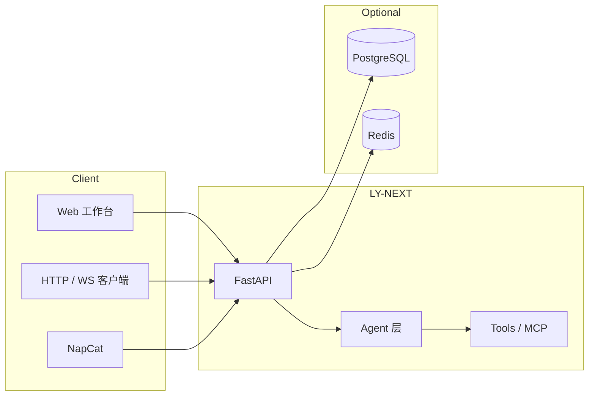

<div align="center">

# LY-NEXT

**FastAPI + LangGraph 智能体服务 · 内置 Web 工作台 · 可选 PostgreSQL / pgvector / Redis**

<br />

[](./LICENSE)
[](https://www.python.org/downloads/)
[](https://fastapi.tiangolo.com/)
[](https://github.com/langchain-ai/langgraph)
[](./docker/README.md)

<br />

[](https://github.com/liuyingjiang-wei/LY-NEXT)
[](https://gitee.com/wei2335/LY-NEXT)
[](https://gitcode.com/liuyingjiang/ly-next)
[](./pyproject.toml)

</div>

---

## 目录

- [概览](#概览)
- [特性](#特性)
- [架构](#架构)
- [快速开始](#快速开始)
- [Web 工作台](#web-工作台)
- [NapCat / OneBot](#napcat--onebot-v11)
- [Docker](#docker)
- [安装依赖](#安装可选-redis--postgresql--pgvector)
- [配置](#配置)
- [常用接口](#常用接口)
- [文档](#文档)
- [开发](#开发)
- [常见问题](#常见问题)

---

## 概览

LY-NEXT 是一套可自托管的 Agent 运行时：HTTP / WebSocket 对话、MCP 工具暴露、多模型路由、Run 链路追踪与会话持久化，并通过 `/ly/` Web 工作台完成配置与运维。

| 路径 | 说明 |
|------|------|
| `ly_next/` | Python 应用包 |
| `config/` | 默认配置模板（首次运行参与生成用户配置） |
| `install/` | 本机 Redis / PostgreSQL 安装脚本 |
| `data/` | 运行时数据、`config.yaml`、提示词与日志 |
| `www/` | 前端静态资源（首页 / 工作台 / 登录） |

---

## 特性

| 能力 | 说明 |
|------|------|
| **Agent 模式** | ReAct · Plan-then-Act · Coordinator · Chat |
| **LLM** | OpenAI / Anthropic / Ollama / OpenAI 兼容网关 |
| **MCP** | 内置 MCP Server；可选远端 MCP（`langchain-mcp-adapters`） |
| **存储** | 可选 PostgreSQL + pgvector、Redis |
| **Web** | `/` 首页 · `/ly/` 工作台 · `/ly/login` 登录 |
| **桥接** | NapCat 反向 OneBot v11 WebSocket |

---

## 架构



---

## 快速开始

```bash
git clone https://github.com/liuyingjiang-wei/LY-NEXT.git
cd LY-NEXT
uv sync
uv run ly
```

浏览器访问：

| 地址 | 说明 |
|------|------|
| `http://127.0.0.1:8000/` | 首页 |
| `http://127.0.0.1:8000/ly/` | 工作台（需登录） |
| `http://127.0.0.1:8000/docs` | OpenAPI 文档 |

> `uv sync` 默认安装 **dev** 依赖（pytest、ruff 等）。最小镜像可用 `uv sync --no-default-groups`。

**环境要求：** Python ≥ 3.10（推荐 3.11/3.12）· [uv](https://docs.astral.sh/uv/) 包管理

```bash
uv run ly --reload
uv run ly --host 127.0.0.1 --port 8000   # 仅本机
```

---

## Web 工作台

| 路径 | 说明 |
|------|------|
| `/` | 营销首页（`www/home.html`） |
| `/ly/` | 控制台（`www/app.html`，需登录） |
| `/ly/login` | 登录；`POST /ly/login` 提交 `api_key` 写入 Cookie |
| `/ly/static/*` | 静态资源 |

默认启用服务鉴权：请求头 `X-API-Key` 或登录 Cookie，对应 `auth.api_key`（与 LLM 密钥无关）。

工作台 **「应用配置」** / **「模型配置」** 通过 `GET/PATCH /api/system/settings` 读写同一配置文件。自检：`GET /api/system/extensions`。

---

## NapCat / OneBot v11

<details>
<summary><strong>展开：连接配置与排错</strong></summary>

NapCat 使用 **反向 WebSocket（客户端）**。在 NapCat WebUI → **网络配置** → 新建 **WebSocket 客户端**：

| 项 | 值 |
|----|-----|
| URL | `ws://127.0.0.1:8000/onebot/v11/ws`（端口与 `server.port` 一致） |
| Token | 与 `bridge.onebot11.access_token` 一致；**两边都留空则都留空** |

别名路径：`ws://127.0.0.1:8000/OneBotv11`。

上述路径**不经过**工作台 `X-API-Key`；仅当配置了 `access_token` 时才校验 Bearer / `?access_token=`。

**403 Forbidden 排查：**

1. **完全退出**旧进程后重新启动（改代码后必须重启 uvicorn）
2. 启动日志应出现 `[onebot11] NapCat connected`
3. 确认 NapCat 为 **WebSocket 客户端**，URL 无多余斜杠

`bridge.onebot11.enabled` 须为 `true`（`data/ly_next/config.yaml` 或工作台 **QQ / NapCat** 页）。

**自动回复范围**（`bridge.onebot11.triggers`）：默认仅私聊与群聊 @ 本号。会话键 `onebot:private:{qq}` / `onebot:group:{群号}` 映射到数据库 thread。

</details>

---

## Docker

详见 [docker/README.md](./docker/README.md)。

```bash
# 仅 Redis + PostgreSQL
docker compose -f docker/docker-compose.yml up -d

# 构建并运行应用
docker compose -f docker/docker-compose.yml --profile app up -d --build
```

---

## 安装（可选：Redis / PostgreSQL / pgvector）

```bash
# Linux / macOS
bash install.sh

# Windows
powershell -ExecutionPolicy Bypass -File ".\install.ps1"
```

详细说明见 [install/README.md](./install/README.md)。

---

## 配置

首次启动创建 **`data/ly_next/config.yaml`**（模板合并 + 自动补齐 `prompts/`、`knowledge/`；不覆盖已有文件）。

| 环境变量 | 用途 |
|----------|------|
| `LY_NEXT_CONFIG_DIR` | 用户配置目录（可写） |
| `LY_NEXT_PROJECT_ROOT` | 项目根 |
| `DATABASE_HOST` / `REDIS_HOST` | 容器或远程主机名 |

常用项：`openai_llm.api_key`、`llm.default_provider`、`database.*`、`redis.*`、`auth.*`

<details>
<summary><strong>展开：识图预描述 + 多模型路由</strong></summary>

若多模态模型仅适合「看图说明」，主对话想用更强纯文本模型：

1. 开启 `agent.vision_precaption.enabled`
2. 配置 `provider` / `model`（或留空以使用 `model_router.routes.vision`）
3. 仅对**最后一条**含图消息做预描述，主模型不再收到图片块

预描述在路由**之前**执行，主轮不含图时不会命中 `routes.vision`。共用路由视觉模型：设 `agent.vision_precaption.use_router_vision_model: true` 且 `vision_precaption.model` 留空。

</details>

---

## 常用接口

| 方法 | 路径 | 说明 |
|------|------|------|
| GET | `/api/health` | 健康检查 |
| GET | `/api/runs`、`/api/runs/{id}/events` | Run 追踪 |
| POST | `/api/threads` | 会话（需 PostgreSQL） |
| POST | `/api/chat` | 对话（可选 `thread_id`） |
| GET | `/api/tasks` | 任务列表 |
| GET | `/api/tools` | 工具列表 |
| GET/POST | `/mcp` | MCP 协议 |

完整列表见 `/docs` 或工作台 **API 调试** 页。

---

## 文档

| 文档 | 内容 |
|------|------|
| [TECHNICAL.md](./TECHNICAL.md) | 代码阅读路径与请求链路 |
| [SECURITY.md](./SECURITY.md) | 威胁模型与安全检查项 |
| [AGENTS.md](./AGENTS.md) | 智能体协作约定 |
| [install/README.md](./install/README.md) | 依赖安装 |
| [docker/README.md](./docker/README.md) | 容器部署 |

---

## 开发

```bash
uv sync
uv run ruff format .
uv run ruff check .
uv run pytest -q
```

---

## 常见问题

<details>
<summary><strong>未生成用户配置</strong></summary>

检查 `data/` 或 `LY_NEXT_CONFIG_DIR` 目录是否可写。

</details>

<details>
<summary><strong>NapCat 连接 403</strong></summary>

见上文 [NapCat 排错](#napcat--onebot-v11)，确保进程已重启且路由已挂载。

</details>

---

<div align="center">

**MIT License** · [LICENSE](./LICENSE)

</div>
