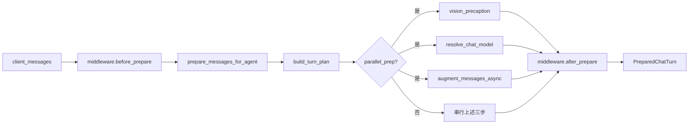
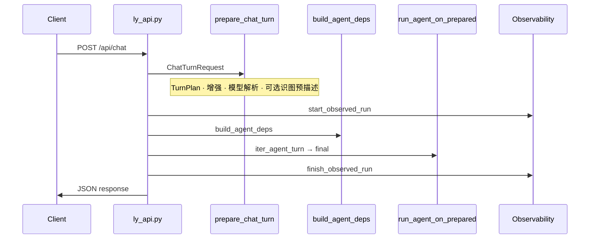
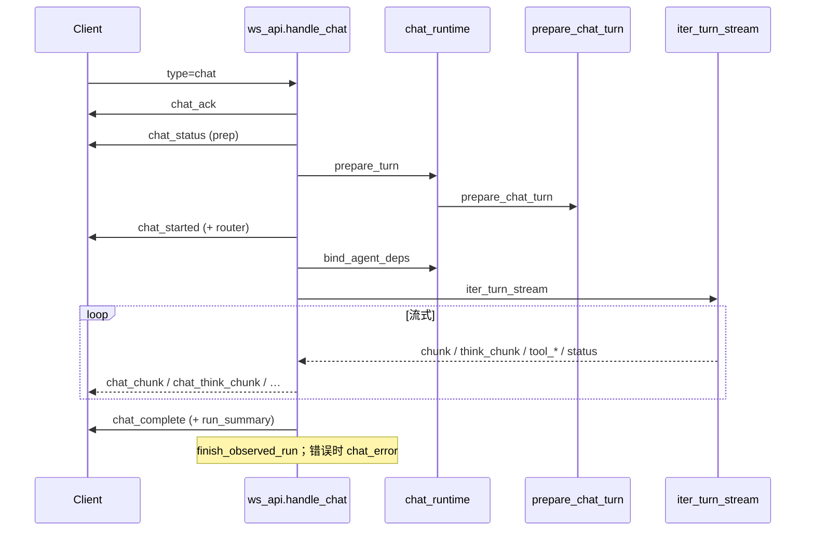

# LY-NEXT 技术说明

[← 返回 README](./README.md)

---

## 目录

- [推荐阅读顺序](#推荐阅读顺序)
- [对话请求链路](#对话请求链路)
- [Agent 层](#agent-层)
- [插件扩展点](#插件扩展点)
- [会话与追踪](#会话与追踪)
- [LLM 层](#llm-层)
- [配置与运行时](#配置与运行时)
- [可观测性](#可观测性-p0)
- [调试建议](#调试建议)

---

## 推荐阅读顺序

| # | 路径 | 关注点 |
|---|------|--------|
| 1 | `ly_next/main.py` | 启动、路由挂载、生命周期、`ModelRegistry.ensure_loaded` |
| 2 | `ly_next/api/` | `ly_api` · `ws_api` · `runs_api` · `threads_api` · `models_api` · `plugin_router` |
| 3 | `ly_next/agent/chat_pipeline.py` | **`prepare_chat_turn`**：中间件、TurnPlan、并行 prep |
| 4 | `ly_next/agent/chat_runtime.py` | WS 共享：`begin_chat_task` · `prepare_turn` · `iter_turn_stream` |
| 5 | `ly_next/agent/turn_engine.py` | `iter_direct_answer` · `iter_agent_turn` |
| 6 | `ly_next/agent/factory.py` | react / plan / chat / coordinator |
| 7 | `ly_next/agent/react/` | compat · native · legacy 三套 ReAct |
| 8 | `ly_next/agent/deps.py` | LLM 客户端、流式解析、工具调用 |
| 9 | `ly_next/agent/chat_model.py` · `vision_precaption.py` | 模型解析与识图预描述 |
| 10 | `ly_next/models/registry.py` · `factory.py` · `openai_compat.py` | 注册表与客户端 |
| 11 | `ly_next/messaging/onebot_commands.py` | OneBot 指令扩展（如 jmcomic `#车牌`） |
| 12 | `ly_next/core/plugin/loader.py` | PluginLoader 扫描与注册 |
| 13 | `tools/` · `mcp/` · `rag/` · `core/` | 工具、MCP、检索、配置与存储 |

---

## 对话请求链路

HTTP 与 WebSocket 共用 **`prepare_chat_turn`**，差异在传输层与流式事件。

### `prepare_chat_turn` 内部（简化）

### HTTP（阻塞）

### WebSocket（流式）

**WS 事件顺序（典型）：** `chat_ack` → `chat_status` → `chat_started` → `chat_status`(llm) → `chat_think_chunk`? → `chat_chunk`* → `chat_complete`

**前端：** 工作台 `ChatPanel` 经 `chatTransport.js` 优先 WebSocket，超时或连接失败时回退 `POST /api/chat`。

---

## Agent 层

| 模式 | 说明 |
|------|------|
| **react** | compat（JSON 决策）· native（`chat_with_tools`）· legacy（LangGraph plan→act→check） |
| **plan** | 先生成步骤再逐步执行 |
| **chat** | 单轮直答；`iter_direct_answer` 热路径，无工具 |
| **coordinator** | 分解 → 多 ReactAgent 委托 → 汇总 |

`TurnPlan` 可标记 `fast_path`（如纯 chat）、`skip_aug` 等，影响是否走并行 prep 与工具挂载。

> 仅 **legacy** react 与 **plan** 使用 LangGraph checkpoint。

---

## 插件扩展点

启动时 `PluginLoader` 顺序：内置插件 → `plugins/` + `plugins.extra_dirs`（默认 `plugins/local/`）→ `plugins.modules` → pip entry points。

| 钩子 | 用途 | 示例 |
|------|------|------|
| `register_tools` | Agent 工具 | jmcomic `jmcomic_search` |
| `register_apis` | FastAPI 子路由 | jmcomic `/api/jmcomic/*` |
| `register_bridges` | 消息桥 WS/HTTP | qq-onebot · telegram-bot |
| `on_startup` | 挂载静态资源等 | jmcomic `/media` |
| OneBot 指令 | `register_onebot_command_handler` | jmcomic `#车牌` |

**本地插件示例（本工作区）：**

| 插件 | 类型 | 路由 / 能力 |
|------|------|-------------|
| `qq-onebot` | 桥接 | `/api/onebot11/*` · NapCat WS |
| `telegram-bot` | 桥接 | `/api/telegram/*` · 配对码 |
| `jmcomic` | 能力 | `/api/jmcomic/*` · 工具 · `#车牌` |

详见 [plugins/README.md](./plugins/README.md) 与 [jmcomic_plugin/README.md](./plugins/local/jmcomic_plugin/README.md)。

---

## 会话与追踪

| 标识 | 含义 |
|------|------|
| `thread_id` | 跨轮会话；持久化于 `sessions` / `messages`（需 PostgreSQL） |
| `task_id` / `run_id` | 单次请求；写入 `agent_runs` / `agent_run_events` |

查询：`GET /api/runs`（`agent.observability.enabled: false` 时 404）。鉴权为 `auth.api_key`，非模型密钥。

---

## LLM 层

- 启动：`ensure_llm_models_migrated()` → `ModelRegistry.ensure_loaded()`（读取 `llm.models[]`）
- `models/registry.py` — 命名模型注册表；兼容旧版 `*_llm` 配置块
- `models/factory.py` — 按 format 创建客户端（openai / anthropic / ollama / openai_compat）
- `agent/chat_model.py` — `resolve_chat_model` 解析每轮 provider/model
- `build_agent_deps` — 通过 `ModelRegistry.build_client_kwargs` 绑定 LLM 客户端
- `api/models_api.py` — `GET/POST/DELETE /api/models`、默认模型、连通性测试
- `models/openai_compat.py` — 请求/流式/错误；流式 delta 解析见 `agent/llm_text.py`

---

## 配置与运行时

| 文件 | 说明 |
|------|------|
| `data/ly_next/config.yaml` | 用户主配置（首次从 `config/default_config.yaml` 生成） |
| `ly_next/default_config.yaml` | 打包默认值（含 `bridge.*`），每次 load 合并 |
| `plugins.jmcomic` 等 | 插件覆盖块（可选） |

接口：`GET/PATCH /api/system/settings`（深度合并）。

关键项：`llm.default_model` · `llm.models` · `agent.reasoning_mode` · `agent.stream_output` · `agent.chat_pipeline.*`

默认端口：**8000**（`server.port` / `LY_NEXT_PORT` / 交互式选择）。

---

## 可观测性（P0）

| 配置键 | 说明 |
|--------|------|
| `agent.observability.enabled` | 总开关 |
| `persist` | 持久化 Run 事件 |
| `ws_run_summary` | WS 摘要推送 |
| `store_prompts` | 是否存储 prompt 快照 |

入口：`run_lifecycle.start_observed_run` / `finish_observed_run`；过程：`run_telemetry`。

日志前缀：`[ws.chat]` · `[turn_engine]` · `[chat]` · `[openai_compat]`

---

## 调试建议

1. **入口层** — `ly_api.py` / `ws_api.py` 请求与 WS 帧；DevTools → Network → WS
2. **Pipeline** — `prepare_chat_turn` 是否改写 mode（如 react → chat fast_path）
3. **Agent 层** — 模式与工具过滤；`channel_tools` 策略
4. **流式** — `deps._iter_response_stream` · `llm_text.content_from_stream_delta`
5. **Model 层** — `openai_compat` 组包；401/超时；`vision_precaption` 降级
6. **RAG 层** — embedding 不可用时的 lexical 回退
7. **插件** — `GET /api/system/extensions`；OneBot 指令是否先于 auto_reply 命中
