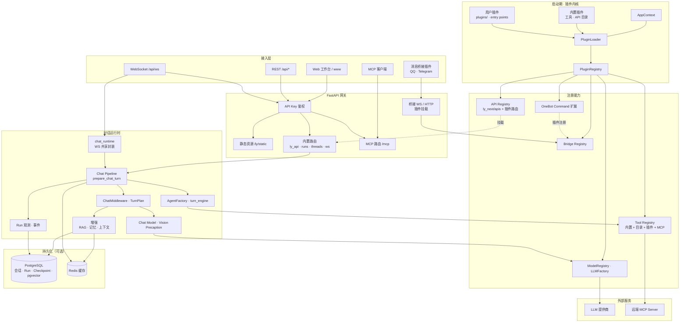
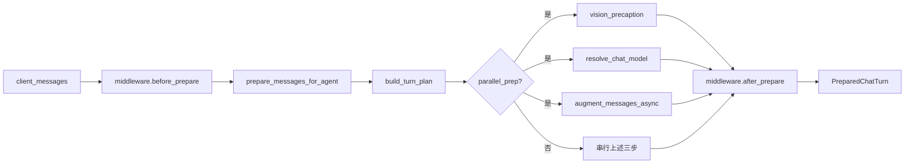
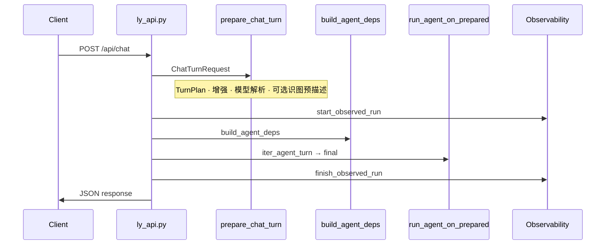
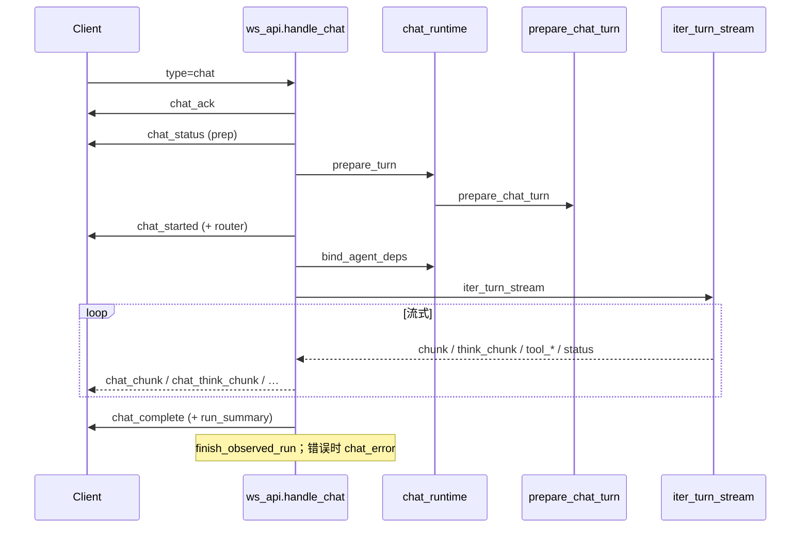

<div align="center">

# LY-NEXT 技术说明

面向 **二次开发、排障、部署集成** 的文档。新用户上手请看 [README.md](./README.md) 与 [docs/QUICKSTART.md](./docs/QUICKSTART.md)；使用排障见 [docs/USER.md](./docs/USER.md)。

[](./pyproject.toml)
[](https://fastapi.tiangolo.com/)
[](https://github.com/langchain-ai/langgraph)

</div>

---

## 目录

- [项目结构](#项目结构)
- [系统架构](#系统架构)
- [推荐阅读顺序](#推荐阅读顺序)
- [对话请求链路](#对话请求链路)
- [Agent 层](#agent-层)
- [插件扩展点](#插件扩展点)
- [会话与追踪](#会话与追踪)
- [LLM 层](#llm-层)
- [配置与运行时](#配置与运行时)
- [常用 HTTP 接口](#常用-http-接口)
- [可观测性](#可观测性)
- [开发命令](#开发命令)
- [常见问题（技术向）](#常见问题技术向)
- [调试建议](#调试建议)

---

## 项目结构

| 路径 | 说明 |
|------|------|
| `ly_next/` | Python 应用（API、Agent、插件内核） |
| `config/` | 默认配置模板，首次运行参与生成用户配置 |
| `plugins/` | 示例单文件插件；**独立插件**装到 `plugins/local/` 或 pip |
| `ly_next/apis/` | 以 `.py` 扩展 HTTP API |
| `.workbench-src/` | 工作台前端源码；构建产物输出到 `www/` |
| `install/` | 依赖安装脚本与说明（同机 / Docker / 远程） |
| `data/` | 运行时数据、`config.yaml`、提示词与日志（gitignore） |
| `www/` | 已构建的静态资源（随仓库发布） |

---

## 系统架构

PostgreSQL / Redis 未部署时，会话持久化、RAG、Run 追踪等能力相应降级。

### 分层总览



### 模块职责速查

| 模块 | 职责 |
|------|------|
| **PluginLoader** | 启动时加载插件并向 Tool / LLM / API / Bridge 注册；`plugins.enabled=false` 时仅保留内置 |
| **prepare_chat_turn** | 对话前统一入口：中间件、TurnPlan、并行 prep、模型解析 |
| **chat_runtime** | WebSocket：`prepare_turn` · `iter_turn_stream` · 任务生命周期 |
| **消息桥接** | QQ / Telegram 以插件挂载；WS 桥接在 `create_app` 早期注册 |
| **OneBot 指令** | 插件可注册自定义群/私聊指令，在 auto_reply 之前由 core 分发 |
| **MCP** | 对外 `/mcp`；可选连接远端 MCP Server |

---

## 推荐阅读顺序

| # | 路径 | 关注点 |
|---|------|--------|
| 1 | `ly_next/main.py` | 启动、路由挂载、生命周期、`ModelRegistry.ensure_loaded` |
| 2 | `ly_next/api/` | `ly_api` · `ws_api` · `runs_api` · `threads_api` · `models_api` · `plugin_router` |
| 3 | `ly_next/agent/chat_pipeline.py` | **`prepare_chat_turn`**：中间件、TurnPlan、并行 prep |
| 4 | `ly_next/agent/chat_runtime.py` | WS 共享：`begin_chat_task` · `prepare_turn` · `iter_turn_stream` |
| 5 | `ly_next/agent/turn_engine.py` | `iter_direct_answer` · `iter_agent_turn` |
| 6 | `ly_next/agent/factory.py` | react / plan / chat / coordinator |
| 7 | `ly_next/agent/react/` | compat · native · legacy 三套 ReAct |
| 8 | `ly_next/agent/deps.py` | LLM 客户端、流式解析、工具调用 |
| 9 | `ly_next/agent/chat_model.py` · `vision_precaption.py` | 模型解析与识图预描述 |
| 10 | `ly_next/models/registry.py` · `factory.py` · `openai_compat.py` | 注册表与客户端 |
| 11 | `ly_next/messaging/onebot_commands.py` | OneBot 指令扩展 |
| 12 | `ly_next/core/plugin/loader.py` | PluginLoader 扫描与注册 |
| 13 | `tools/` · `mcp/` · `rag/` · `core/` | 工具、MCP、检索、配置与存储 |

工作台前端：`.workbench-src/`，构建 `pnpm build:workbench` → `www/`。

---

## 对话请求链路

HTTP 与 WebSocket 共用 **`prepare_chat_turn`**，差异在传输层与流式事件。

### `prepare_chat_turn` 内部（简化）



### HTTP（阻塞）



### WebSocket（流式）



**WS 事件顺序（典型）：** `chat_ack` → `chat_status` → `chat_started` → `chat_status`(llm) → `chat_think_chunk`? → `chat_chunk`* → `chat_complete`

**前端：** `ChatPanel` 经 `chatTransport.js` 优先 WebSocket，失败时回退 `POST /api/chat`。

---

## Agent 层

| 模式 | 说明 |
|------|------|
| **react** | compat（JSON 决策）· native（`chat_with_tools`）· legacy（LangGraph plan→act→check） |
| **plan** | 先生成步骤再逐步执行 |
| **chat** | 单轮直答；`iter_direct_answer` 热路径，无工具 |
| **coordinator** | 分解 → 多 ReactAgent 委托 → 汇总 |

`TurnPlan` 可标记 `fast_path`（如纯 chat）、`skip_aug` 等，影响是否走并行 prep 与工具挂载。

> 仅 **legacy** react 与 **plan** 使用 LangGraph checkpoint。

工作台 **compat 引擎**（`tool_call_mode` / `prefer_compat_when_mcp_tools`）在「智能体进阶 → 兼容引擎」；默认推荐 native/auto。

---

## 插件扩展点

启动时 `PluginLoader` 顺序：内置插件 → `plugins/` + `plugins.extra_dirs`（默认 `plugins/local/`）→ `plugins.modules` → pip entry points。

**插件与 core 分仓：** 见 [plugins/README.md](./plugins/README.md)。

最小单文件示例（`plugins/hello_plugin.py`）：

```python
from ly_next.core.plugin.protocol import LyNextPlugin

class MyPlugin(LyNextPlugin):
    name = "my-stuff"
    version = "0.1.0"

    def register_tools(self, registry, ctx):
        ...

plugin = MyPlugin()
```

| 方式 | 配置 / 位置 | 说明 |
|------|-------------|------|
| 目录插件 | `plugins/local/` | 官方桥接（qq-onebot、telegram-bot）及第三方能力插件 |
| 动态 HTTP API | `ly_next/apis/*.py` | [ly_next/apis/README.md](./ly_next/apis/README.md) |
| 动态工具 | `tools.plugin_dir` | 带 `@tool` 的 `.py` |
| pip entry point | `ly_next.plugins` | 打包分发 |

| 钩子 | 用途 |
|------|------|
| `register_tools` | Agent 工具 |
| `register_apis` | FastAPI 子路由 |
| `register_bridges` | 消息桥 WS/HTTP |
| `on_startup` | 静态资源等 |
| `register_onebot_command_handler` | OneBot 文本指令 |

生产环境：`plugins.security_profile` / `api.security_profile` / `tools.security_profile` 限制目录扫描，见 [SECURITY.md](./SECURITY.md)。加载状态：`GET /api/system/extensions`。

---

## 会话与追踪

| 标识 | 含义 |
|------|------|
| `thread_id` | 跨轮会话；持久化于 `sessions` / `messages`（需 PostgreSQL） |
| `task_id` / `run_id` | 单次请求；写入 `agent_runs` / `agent_run_events` |

查询：`GET /api/runs`（`agent.observability.enabled: false` 时 404）。鉴权为 `auth.api_key`，非模型密钥。

---

## LLM 层

- 启动：`ensure_llm_models_migrated()` → `ModelRegistry.ensure_loaded()`（读取 `llm.models[]`）
- `models/registry.py` — 命名模型注册表；兼容旧版 `*_llm` 配置块
- `models/factory.py` — 按 format 创建客户端（openai / anthropic / ollama / openai_compat）
- `agent/chat_model.py` — `resolve_chat_model` 解析每轮 provider/model
- `api/models_api.py` — `GET/POST/DELETE /api/models`、默认模型、连通性测试
- `models/openai_compat.py` — 请求/流式/错误；流式 delta 见 `agent/llm_text.py`

---

## 配置与运行时

| 文件 | 说明 |
|------|------|
| `data/ly_next/config.yaml` | 用户主配置（首次从 `config/default_config.yaml` 生成） |
| `ly_next/default_config.yaml` | 打包默认值，每次 load 合并 |

接口：`GET/PATCH /api/system/settings`（深度合并）；保存响应含 `settings_effects`（热更新 / 需重启项）。

| 环境变量 | 用途 |
|----------|------|
| `LY_NEXT_CONFIG_DIR` | 用户配置目录 |
| `LY_NEXT_PROJECT_ROOT` | 项目根 |
| `LY_NEXT_PORT` | 监听端口（配合 `--no-prompt`） |
| `DATABASE_HOST` / `REDIS_HOST` | 容器或远程服务 |

常用键：`llm.models` · `llm.default_model` · `agent.reasoning_mode` · `agent.tool_policy.max_tier` · `auth.*` · `plugins.*`

默认端口：**8000**（`server.port` / `LY_NEXT_PORT` / 交互式选择）。

### 识图预描述

多模态仅用于识图、主对话用纯文本模型时：

1. `agent.vision_precaption.enabled: true`
2. 注册多模态模型，设 `agent.vision_precaption.model_name`
3. 仅对最后一条含图消息预描述

### 联网 search / fetch

```yaml
tools:
  web_search:
    provider: duckduckgo   # 或 tavily 等
  web_fetch:
    provider: jina         # jina | tavily | firecrawl | trafilatura
    default_max_length: 8000
```

推荐链：`web_search` → `web_fetch` → 汇总；「联网调研」场景已内置提示。

### 办公导出工具

`generate_docx` / `generate_xlsx` / `generate_pptx` 写入 `data/ly_next/exports/`，返回 `download_url`。

---

## 常用 HTTP 接口

| 方法 | 路径 | 说明 |
|------|------|------|
| GET | `/api/health` | 健康检查 |
| GET | `/api/system/readiness` | 工作台就绪（LLM / PG / Redis） |
| GET | `/api/system/settings` | 可读配置（密钥脱敏） |
| PATCH | `/api/system/settings` | 深度合并保存 |
| GET | `/api/system/extensions` | 插件、桥接、工具数量 |
| GET | `/api/system/plugins/catalog` | 官方插件目录与 doctor 状态 |
| GET/POST/DELETE | `/api/models` | 模型注册表 |
| POST | `/api/chat` | 对话（可选 `thread_id`） |
| POST | `/api/threads` | 会话（需 PostgreSQL） |
| GET | `/api/runs`、`/api/runs/{id}/events` | Run 追踪 |
| GET | `/api/tools` | 工具列表 |
| GET/POST | `/mcp` | MCP 协议 |
| WS | `/api/ws` | 流式对话、`type=chat` |

桥接路由（需安装对应插件）：`/api/onebot11/*`、`/api/telegram/*` 等；第三方能力插件另挂各自前缀。完整列表见 `/docs` 或工作台「API 调试」。

---

## 可观测性

| 配置键 | 说明 |
|--------|------|
| `agent.observability.enabled` | 总开关 |
| `persist` | 持久化 Run 事件 |
| `ws_run_summary` | WS 摘要 |
| `store_prompts` | 存储 prompt 快照（Run 历史可见） |

入口：`run_lifecycle.start_observed_run` / `finish_observed_run`；过程：`run_telemetry`。

日志前缀：`[ws.chat]` · `[turn_engine]` · `[chat]` · `[openai_compat]`

---

## 开发命令

```bash
uv sync
uv run ly --reload

# 后端
uv run ruff format . && uv run ruff check .
uv run pytest -q

# 工作台前端（在仓库根）
pnpm install
pnpm build:workbench    # 输出到 www/
pnpm test:workbench
```

`www/` 为构建产物；改 UI 请编辑 `.workbench-src/` 后重新 build。勿手改 `www/` 除非了解发布流程。

其它：

```bash
uv run ly doctor --json
uv run ly --show-full-api-key   # 启动日志显示完整 API 密钥
```

约定与模块索引：[AGENTS.md](./AGENTS.md)。

---

## 常见问题（技术向）

**未生成 `config.yaml`** — 检查 `data/` 或 `LY_NEXT_CONFIG_DIR` 写权限。

**插件未加载** — `plugins.enabled`、对应 `bridge.*.enabled`；`plugins.security_profile=production` 会跳过未信任目录；查 `GET /api/system/extensions`。

**对话一直思考无输出** — `GET /api/system/readiness`；WS 是否收到 `chat_status` / `chat_chunk`；Reasoner 模型先出 `chat_think_chunk`；查 `[ws.chat]` 日志。

**工作台 UI 未更新** — `pnpm build:workbench` 后重启 `uv run ly`，清浏览器缓存。

更多用户向排障：[docs/USER.md](./docs/USER.md)。

---

## 调试建议

1. **入口层** — `ly_api.py` / `ws_api.py`；DevTools → Network → WS
2. **Pipeline** — `prepare_chat_turn` 是否改写 mode（react → chat fast_path）
3. **Agent** — 模式与 `tool_policy`；`channel_tools` 过滤
4. **流式** — `deps._iter_response_stream` · `llm_text.content_from_stream_delta`
5. **Model** — `openai_compat` 401/超时；`vision_precaption` 降级
6. **RAG** — embedding 不可用时的 lexical 回退
7. **插件** — OneBot 指令是否先于 auto_reply 命中

---

<div align="center">

[← 返回 README](./README.md)

</div>
