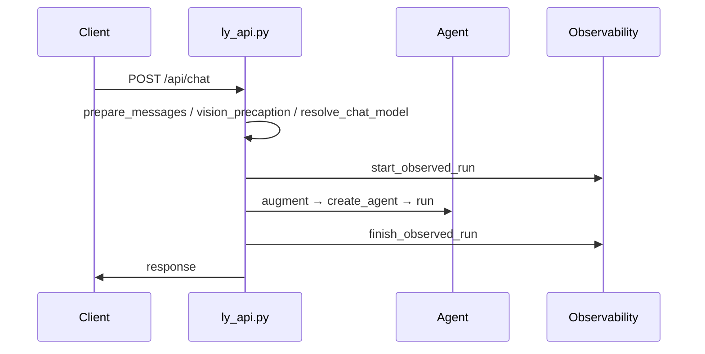

<div align="center">

# LY-NEXT 技术说明

[](./pyproject.toml)
[](https://fastapi.tiangolo.com/)
[](https://github.com/langchain-ai/langgraph)

[← 返回 README](./README.md)

</div>

---

## 目录

- [推荐阅读顺序](#推荐阅读顺序)
- [对话请求链路](#对话请求链路)
- [Agent 层](#agent-层)
- [会话与追踪](#会话与追踪)
- [LLM 层](#llm-层)
- [配置与运行时](#配置与运行时)
- [可观测性](#可观测性-p0)
- [调试建议](#调试建议)

---

## 推荐阅读顺序

| # | 路径 | 关注点 |
|---|------|--------|
| 1 | `ly_next/main.py` | 启动、路由挂载、生命周期 |
| 2 | `ly_next/api/` | `ly_api` · `ws_api` · `runs_api` · `threads_api` · `models_api` · `loader` · `mcp_api` |
| 3 | `ly_next/agent/factory.py` | 模式选择 react / plan / chat / coordinator |
| 4 | `ly_next/agent/react.py` 等 | 各模式实现 |
| 5 | `prompt_augment.py` · `prompt_templates.py` | 上下文增强与提示词 |
| 6 | `agent/deps.py` | LLM、工具、运行参数 |
| 7 | `chat_model.py` · `vision_precaption.py` | 默认模型解析与识图预描述 |
| 8 | `models/registry.py` · `models/factory.py` · `openai_compat.py` | 模型注册表与客户端 |
| 9 | `tools/` · `mcp/` | 工具与 MCP |
| 10 | `rag/` | 检索与 embedding |
| 11 | `core/` | 配置、DB、缓存、checkpoint、run 存储 |

---

## 对话请求链路

### HTTP（非流式）



### WebSocket（流式）

```
/api/ws  type=chat
→ ws_api.handle_chat()
→ 同上预处理链
→ agent.run_stream()
→ chat_chunk / chat_status / chat_tool_* / chat_complete
```

---

## Agent 层

| 模式 | 说明 |
|------|------|
| **react** | compat（JSON 工具）· native（`chat_with_tools`）· legacy（LangGraph plan→act→check） |
| **plan** | 先生成步骤再逐步执行 |
| **chat** | 无工具、无图像的最小路径 |
| **coordinator** | 分解 → 多 ReactAgent 委托 → 汇总 |

> 仅 **legacy** react 与 **plan** 使用 LangGraph checkpoint。

---

## 会话与追踪

| 标识 | 含义 |
|------|------|
| `thread_id` | 跨轮会话；持久化于 `sessions` / `messages`（需 PostgreSQL） |
| `task_id` / `run_id` | 单次请求；写入 `agent_runs` / `agent_run_events` |

查询：`GET /api/runs`（`agent.observability.enabled: false` 时 404）。鉴权为 `auth.api_key`，非模型密钥。

---

## LLM 层

- `models/registry.py` — 命名模型注册表（`llm.models[]`），启动时从旧版 `*_llm` 块自动迁移
- `models/factory.py` — 按 format（openai / anthropic / ollama / openai_compat）创建客户端并缓存
- `agent/chat_model.py` — 解析对话轮次使用的默认或指定注册模型
- `api/models_api.py` — `GET/POST/DELETE /api/models`、切换默认、连通性测试
- `models/openai_compat.py` — 请求/流式/错误处理
- `models/openai_chat_body.py` — token 字段组装策略

---

## 配置与运行时

- 主配置：`data/ly_next/config.yaml`
- 接口：`GET/PATCH /api/system/settings`（深度合并）
- 关键项：`llm.default_model` · `llm.models` · `agent.reasoning_mode` · `agent.stream_output`

---

## 可观测性（P0）

| 配置键 | 说明 |
|--------|------|
| `agent.observability.enabled` | 总开关 |
| `persist` | 持久化 Run 事件 |
| `ws_run_summary` | WS 摘要推送 |
| `store_prompts` | 是否存储 prompt 快照 |

入口：`run_lifecycle.start_observed_run` / `finish_observed_run`；过程：`run_telemetry`。

---

## 调试建议

1. **入口层** — `ly_api.py` / `ws_api.py` 请求与响应
2. **Agent 层** — 模式与工具是否按预期
3. **Model 层** — `openai_compat.py` 组包与返回码；`chat_model` / `vision_precaption` 是否改写 provider 与消息
4. **RAG 层** — `rag/*` 是否回退 lexical，embedding 是否可用
5. **基础设施层** — `core/logger.py`、数据库 / Redis 状态、任务与 run 记录
